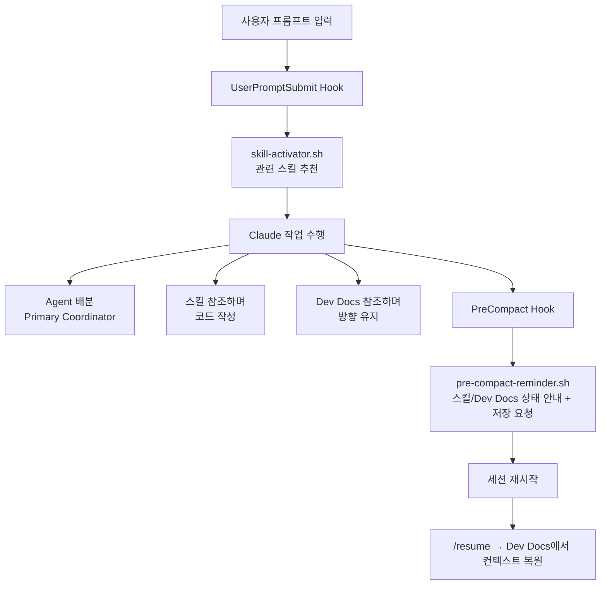

# Claude Code 통합 시스템 셋업 가이드

> 최종 업데이트: 2026-05-16
> Claude Code: v2.1.143 | Models: Opus 4.8 / Fable 5 / Sonnet 4.6 / Haiku 4.5
> v3.1.0 프로토콜 기준, 2026-05 환경에 맞게 갱신

## 개요

이 문서는 [[claude_code_setup_prompt]]를 사용하여 새 프로젝트에 Claude Code 통합 시스템(Parallel Agents + Skills 활성화 + Dev Docs)을 구축하는 전체 과정을 설명합니다.

> [!note] 구축되는 3대 시스템
> - **A. Parallel Agents** - 멀티에이전트 안전 프로토콜 (5개 에이전트)
> - **B. Skills 자동 활성화** - Hook 기반 스킬 강제 적용
> - **C. Dev Docs** - 대규모 작업 컨텍스트 관리 (3-파일 시스템)

---

## STEP 0: 사전 준비

```bash
# 1. 새 프로젝트 디렉토리에서 시작 (또는 기존 프로젝트)
cd your-project
git init  # git 저장소여야 함

# 2. 프로토콜 파일을 프로젝트 루트에 복사
cp "Parallel Agents Safety Protocol v3.1.0.md" \
   ./Parallel_Agents_Safety_Protocol_v3_1_0.md
```

> [!warning] 파일명 주의
> 공백과 한글을 제거하여 `Parallel_Agents_Safety_Protocol_v3_1_0.md`로 복사합니다.
> Claude가 파일을 읽을 때 경로 문제를 방지합니다.

---

## STEP 1: Claude Code 실행

```bash
claude
```

프로젝트 루트에서 Claude Code CLI를 실행합니다.

---

## STEP 2: 프롬프트 입력

[[claude_code_setup_prompt]]의 **"Claude Code에 입력할 프롬프트"** 섹션 안의 코드 블록 전체를 복사하여 붙여넣습니다.

```
첨부 파일 `Parallel_Agents_Safety_Protocol_v3_1_0.md`를 완전히 읽고,
아래 명세에 따라 Claude Code 통합 시스템을 구축해줘.

이 시스템은 3대 핵심 시스템을 한번에 구축합니다:
  A. Parallel Agents (멀티에이전트 안전 프로토콜)
  B. Skills 자동 활성화 (Hook 기반 스킬 강제 적용)
  C. Dev Docs (대규모 작업 컨텍스트 관리)

...이하 전체 복사...
```

> [!tip] 긴 프롬프트가 효과적인 이유
> Claude Code는 1M 컨텍스트를 지원합니다.
> "짧은 지시 + 알아서 해줘"보다 "긴 명세 + 정확히 따라해"가 훨씬 정확한 결과를 냅니다.

---

## STEP 3: Claude의 작업 진행 (자동)

Claude가 순서대로 실행합니다:

```
① 프로토콜 파일 읽기 (Read tool)
   └─ Parallel_Agents_Safety_Protocol_v3_1_0.md 전체 읽기

② PART A: Parallel Agents (v2.1.143 평탄 네임스페이스)
   ├─ mkdir -p .claude/agents
   ├─ .claude/settings.json 생성 (통합 hooks 포함)
   ├─ .claude/agents/primary-coordinator.md
   ├─ .claude/agents/code-explorer.md         # 또는 Explore subagent_type 활용
   ├─ .claude/agents/code-reviewer.md
   ├─ .claude/agents/test-automation-specialist.md   # v3.1.0의 verify-agent 대체
   ├─ .claude/agents/architect.md             # v3.1.0의 code-architect 대체
   ├─ CLAUDE.md 생성
   └─ docs/ 에 프로토콜 복사

③ PART B: Skills 활성화
   ├─ mkdir -p .claude/hooks
   ├─ .claude/hooks/skill-rules.json
   ├─ .claude/hooks/skill-activator.sh
   ├─ .claude/hooks/pre-compact-reminder.sh   # PostCompact 이벤트 제거됨 → PreCompact로
   └─ chmod +x *.sh

④ PART C: Dev Docs
   ├─ mkdir -p dev/active dev/completed
   ├─ dev/active/.gitkeep, dev/completed/.gitkeep
   ├─ mkdir -p .claude/commands
   ├─ .claude/commands/dev-docs.md
   ├─ .claude/commands/update-dev-docs.md
   ├─ .claude/commands/resume.md
   └─ .claude/commands/save-and-compact.md

⑤ 완료 보고 출력
```

---

## STEP 4: 권한 승인

Claude가 파일을 생성할 때 도구 사용 승인 프롬프트가 뜹니다:

```
Claude wants to use Write to create .claude/settings.json
Allow? (y/n/always)
```

- `y` - 이번 한번만 허용
- `always` - 이후 같은 유형 도구 사용 자동 허용 (권장)

> [!note] 참고
> `chmod +x` 같은 Bash 명령도 승인이 필요합니다.
> `.claude/settings.json`의 permissions가 적용되기 전이므로 수동 승인이 불가피합니다.

---

## STEP 5: 완료 보고 확인

Claude가 작업을 마치면 보고를 출력합니다:

```
## 통합 시스템 구축 완료 보고

### PART A: Parallel Agents
.claude/settings.json              ✅
.claude/agents/primary-coordinator.md   ✅
...

### 주의사항 / 조정 사항
- (API 불일치나 버전 문제 기록)

### 다음 권장 작업
1. Skills 디렉토리에 프로젝트별 스킬 추가
...
```

> [!warning] 반드시 확인
> **"주의사항" 섹션**을 확인하세요.
> Claude가 API 불일치나 현재 버전 미지원 기능을 발견하면 여기에 기록합니다.

---

## STEP 6: 검증

```bash
# 파일 구조 확인
ls -la .claude/
ls -la .claude/agents/
ls -la .claude/hooks/
ls -la .claude/commands/
ls -la dev/

# hook 실행 권한 확인
ls -la .claude/hooks/*.sh
# -rwxr-xr-x  skill-activator.sh
# -rwxr-xr-x  pre-compact-reminder.sh

# 스크립트 동작 테스트
bash .claude/hooks/skill-activator.sh "Create a React component"
# → [SKILLS ACTIVATED]
# → HIGH: frontend-dev-guidelines
```

---

## STEP 7: 첫 사용 테스트

```bash
# Claude Code 재시작 (settings.json 반영)
claude

# 테스트 1: Skills 활성화 확인
> "Create a React login component"
# → [SKILLS ACTIVATED] frontend-dev-guidelines 메시지 확인

# 테스트 2: Dev Docs 생성
> /dev-docs user-dashboard
# → dev/active/user-dashboard/ 에 3개 파일 생성 확인

# 테스트 3: 에이전트 확인
> "Use Explore subagent (or code-explorer if defined) to analyze the project structure"
# → 해당 에이전트가 실행되는지 확인
```

---

## STEP 8: 프로젝트 맞춤 설정 (수동)

| 작업 | 파일 | 설명 |
|------|------|------|
| 스킬 추가 | `.claude/skills/[name]/SKILL.md` | 프로젝트 도메인별 스킬 생성 |
| 트리거 수정 | `.claude/hooks/skill-rules.json` | 실제 스킬에 맞게 키워드 업데이트 |
| 권한 조정 | `.claude/settings.json` | allow/deny 목록 프로젝트에 맞게 수정 |
| 모델 지정 | `.claude/agents/*.md` | 핵심 에이전트(primary-coordinator, architect, code-reviewer)는 Opus 4.8 권장, Fable 5 옵션. test-automation-specialist 등 보조는 Sonnet 4.6도 가능 |
| CLAUDE.md 보강 | `CLAUDE.md` | 코딩 규칙, 아키텍처 결정사항 추가 |

> [!tip] CLAUDE.md 보강 시
> [[CLAUDE.md 템플릿]]과 [[프로젝트별 템플릿]]을 참고하여 프로젝트에 맞게 확장하세요.

> [!note] Workflow 도구 사용 가능
> 멀티에이전트 오케스트레이션은 에이전트 파일 외에 Workflow 도구(인라인 JS, `export const meta` 시작)로도 구성할 수 있습니다. 본문에서 `agent()` / `parallel()` / `pipeline()` 전역 함수로 서브에이전트 실행·동시 실행·항목별 파이프라인을 표현합니다.

---

## 전체 타임라인

```
준비          1분   프로토콜 파일 복사
프롬프트 입력   1분   복사+붙여넣기
Claude 작업   3~5분  17개 파일 자동 생성
권한 승인     1~2분  y 또는 always 선택
검증         2분   파일 구조 + 스크립트 테스트
─────────────────────────────────────
총           약 10분
```

---

## 최종 디렉토리 구조

```
your-project/
├── CLAUDE.md
├── .claude/
│   ├── settings.json
│   ├── agents/
│   │   ├── primary-coordinator.md
│   │   ├── code-explorer.md                   # Explore subagent 활용 가능
│   │   ├── code-reviewer.md
│   │   ├── test-automation-specialist.md      # v3.1.0 verify-agent 대체
│   │   └── architect.md                       # v3.1.0 code-architect 대체
│   ├── hooks/
│   │   ├── skill-rules.json
│   │   ├── skill-activator.sh
│   │   └── pre-compact-reminder.sh            # PostCompact → PreCompact
│   └── commands/
│       ├── dev-docs.md
│       ├── update-dev-docs.md
│       ├── resume.md
│       └── save-and-compact.md
├── dev/
│   ├── active/.gitkeep
│   └── completed/.gitkeep
└── docs/
    └── Parallel_Agents_Safety_Protocol_v3_1_0.md
```

---

## 시스템 간 연계 흐름



---

## 관련 노트

- [[claude_code_setup_prompt]] - 통합 셋업 프롬프트 원문
- [[Parallel Agents Safety Protocol v3.1.0]] - 멀티에이전트 프로토콜
- [[Skills 자동 활성화 시스템]] - Skills Hook 시스템 상세
- [[Dev Docs 시스템]] - Dev Docs 3-파일 시스템 상세
- [[나머지 파일 활용 가이드]] - 템플릿/참조 파일 사용법
