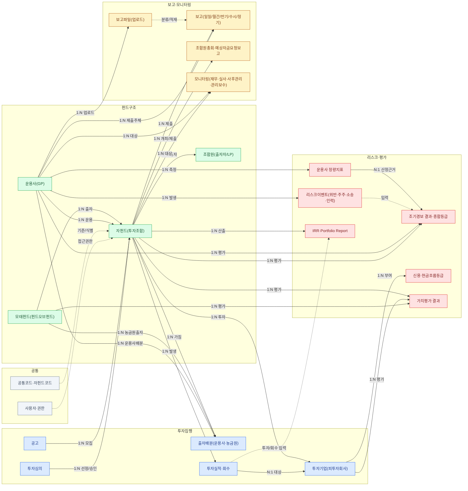
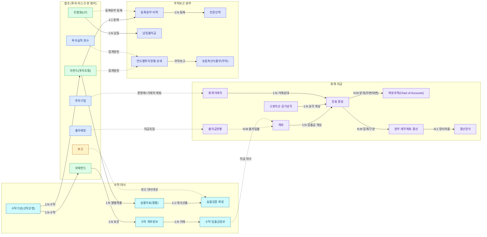
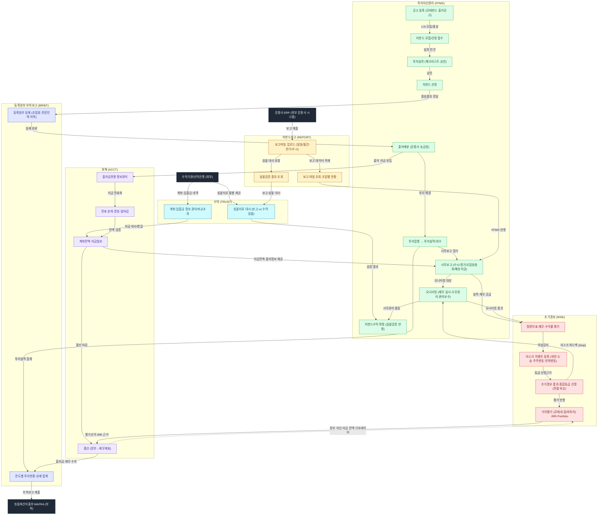

# 농림수산식품모태펀드 현행시스템 — 데이터 구성도 · 업무흐름도

> 출처: docs/Data_backup 화면캡처 5종 + 현행시스템 메뉴표. 개념/논리 레벨. (현행 legacy 시스템이며 대시보드 프로토타입 모델 아님)

---

## 1. 시스템 개요 (6종)

| 시스템 | 역할 | 핵심 엔티티 |
|--------|------|-------------|
| **FFMS** 투자자산관리 | 모태펀드 조성·공고부터 자펀드 선정·출자배분, 투자집행, 사후보고(수시/정기/총회), 투자기업·실적, 모니터링(재무·실사·사후관리·보수)까지의 운용 본체 | 모태펀드, 자펀드, 운용사(GP), 조합원(LP), 공고, 투자심의, 출자배분, 투자기업, 투자실적·회수, 사후보고, 모니터링 |
| **RISK** 조기경보 | 운용사·자펀드 정량지표·재무·수익률을 평가하여 조기경보 결과·종합등급 산정, 리스크 이벤트 관리, 가치평가·IRR·Portfolio Report | 운용사 정량지표, 조기경보 결과·종합등급, 법률·규약위반/주주변동/소송/인력변동, 신용·현금흐름등급, 가치평가, IRR, Portfolio Report |
| **REPORT** 자펀드보고 | 운용사 ERP → 농금원 보고 파일 업로드·분류·조회 채널, 조합별 보고 현황 및 실물검증 결과 조회 | 보고파일(업로드), 일일/월간/반기/수시보고, 실물검증 결과 |
| **TRUST** 수탁 | 수탁기관 실물자료 ↔ 운용사 보고 대사(실물검증), 모태펀드 수탁 계좌·입출금 관리·비교조회 | 수탁기관, 실물자료(월별), 실물검증 결과, 수탁 계좌정보, 입출금정보, 공통/자펀드코드 |
| **BRIEF** 등록원부·부처보고 | 투자조합 법적 등록원부(레지스트리)·이력 관리, 조합원·전문인력·납입출자금 등재, 농림축산식품부 대상 연도별 투자현황 보고 | 등록원부·이력, 조합원, 납입출자금, 전문인력, 연도별투자현황·상세 |
| **ACCT** 회계 | 계정과목·결산양식 기초관리, 전표 분개·증빙·일마감, 장부·재무제표·결산, 고정자산·감가상각, 계좌·자금일보·출자금현황 | 계정과목, 결산양식, 전표·증빙, 장부·재무제표, 회기, 고정자산·감가상각, 계좌, 자금일보, 출자금현황, 회계거래처 |

---

## 2. 데이터 구성도

### 2.1 투자·리스크 구조 (펀드구조 · 투자집행 · 보고·모니터링 · 리스크·평가)

### 2.2 자금·회계·수탁·부처보고 구조 (회계·자금 · 수탁·대사 · 부처보고·원부)

**범례**
- **실선 화살표** = 구조·소유 관계(카디널리티 라벨 `1:N` / `N:M` / `N:1`).
- **점선 화살표(`-.->`)** = 시스템 간 데이터 흐름·대사·집계 연계.
- 가독성을 위해 데이터 구성도를 **두 뷰로 분할**: (2.1) 투자·리스크 구조 = 펀드구조→투자집행→보고·모니터링→리스크·평가, (2.2) 자금·회계·수탁·부처보고 구조. 두 뷰에 모두 나오는 `자펀드`·`모태펀드`는 **동일 엔티티**(2.2에서는 앵커로 참조)다.
- **조합원(LP) 카디널리티 주석**: 동일 LP가 여러 자펀드에 출자할 수 있어 법적 주체 기준은 **N:M**으로 표기. 단, BRIEF 등록원부의 조합원 등재는 자펀드별 행(per-fund row) 기준이므로 등재 관점에서는 **1:N**(`등록원부 1:N 조합원`)이다.

**도메인별 핵심 엔티티**
- **펀드구조**: 모태펀드가 자펀드에 출자(1:N), 운용사(GP)가 자펀드를 운용(1:N), 조합원(LP)이 자펀드에 출자(N:M).
- **투자집행**: 공고 → 자펀드 모집, 투자심의 → 선정, 출자배분(운용사·농금원 2종), 자펀드 → 투자기업 투자, 투자실적·회수 발생.
- **보고·모니터링**: 운용사 보고파일 업로드 → 분류·적재 → 보고, 조합원총회·예상자금요청, 운용사·자펀드 모니터링.
- **리스크·평가**: 운용사 정량지표·리스크이벤트가 조기경보 결과(종합등급)의 산정근거, 투자기업 신용·현금흐름등급, 모태/조합/피투자 가치평가, IRR·Portfolio Report.
- **회계·자금**: 전표가 **계정과목**을 차변/대변으로 참조(분개, N:M)하고 **장부**로 집계·구성(N:M), 장부는 **결산양식**을 따름(N:1). 계좌·고정자산·회계거래처가 전표로 계상, 출자금현황은 계좌를 통해 출자입출(N:M).
- **수탁·대사**: 수탁기관이 자펀드·모태펀드 자산 수탁, 자펀드 실물자료(월별) → 실물검증·확정, 수탁 계좌정보 → 입출금정보(1:N), 입출금정보는 회계 계좌와 자금 대사.
- **부처보고·원부**: 자펀드 → 등록원부 등재(1:1), 조합원/전문인력/납입출자금 등재, 자펀드·투자실적이 연도별투자현황으로 집계되어 농림축산식품부(부처) 보고.

---

## 3. 업무흐름도

**단계 설명** (위 → 아래, end-to-end)
1. **공고·모집·심의** (FFMS): 공고 등록 → 자펀드 모집/신청 접수 → 투자심의(체크리스트·승인) → 선정.
2. **등재·배분** (BRIEF→FFMS): 선정 결과를 BRIEF 등록원부에 등재 → 등재 완료 후 출자배분(운용사·농금원).
3. **투자집행·보고** (FFMS·REPORT): 출자 재원으로 투자집행 → 투자실적/회수. 운용사 ERP가 보고파일 업로드 → 조회·조합별 현황 → FFMS 사후보고 반영.
4. **모니터링·조기경보** (FFMS·RISK): 사후보고 → **모니터링** → 정량지표·재무·수익률 평가 → 이상감지 시 리스크 이벤트 → 종합등급 산정 → 가치평가·IRR.
5. **수탁 대사** (REPORT·TRUST): 보고 실물 대사 요청 → 수탁기관 월별 실물자료와 대사(실물검증) → 검증 결과를 자펀드수탁 확정에 반영.
6. **회계·자금** (FFMS·TRUST·ACCT): 출자 자금 유입 → 전표화. 수탁기관 계좌·입출금 내역 → 자금 대사/정합 → 자금일보 → 결산 마감.
7. **부처보고** (FFMS·ACCT→BRIEF→MAFRA): 투자실적·결산 수치를 연도별 투자현황으로 집계 → 농림축산식품부에 부처보고 제출.

**주요 피드백 루프**
- **리스크 피드백 루프**: `조기경보 종합등급 → 모니터링` — 산정된 종합등급·결과가 사후관리·모니터링의 근거로 환류된다. 모니터링 결과는 다시 정량지표 평가(`f_monitor → k_indicator`)로 들어가 spine(사후보고 → 모니터링 → 조기경보)을 완성한다.
- **회계↔리스크 양방향 정합**: `가치평가·IRR → 결산`(평가손익 근거)과 `결산 장부 자산·자금 잔액 → 가치평가·IRR`(기초데이터)의 양방향 흐름.
- **자금↔예상자금요청 루프**: `자금일보·출자금현황 → 사후보고(조합예상자금요청)` — 자금 잔액·출자 정보가 캐피탈콜/예상자금 보고에 연계된다.
- **사후관리 환류**: `모니터링 → 자펀드수탁 확정` — 사후관리 활동 결과가 수탁 확정 단계에 반영.

---

## 4. 부록 — 시스템별 엔티티·관계 매핑

### 4.1 FFMS — 투자자산관리

| 구분 | 내용 |
|------|------|
| **핵심 엔티티** | 모태펀드, 공고, 자펀드(투자조합), 운용사(GP), 조합원(LP), 투자심의, 출자배분, 투자기업, 투자실적(투자·회수), 보고(수시/정기), 조합원총회, 조합예상자금요청보고, 운용사 재무정보, 투자금 실사보고, 사후관리기록, 관리보수, 수탁검증(실물검증/확정), 사용자/권한/공통코드 |
| **주요 관계** | 모태펀드 →(1:N 출자) 자펀드 · 공고 →(1:N 모집) 자펀드 · 운용사 →(1:N 운용) 자펀드 · 조합원 ↔(N:M 출자) 자펀드 · 자펀드 →(1:N 투자) 투자기업 · 자펀드 →(1:N 발생) 투자실적 →(N:1 대상) 투자기업 · 투자심의 →(1:N 선정/승인) 자펀드 · 자펀드/운용사 →(1:N 제출) 보고 · 운용사 →(1:N 수취) 관리보수 |
| **횡단 링크** | → RISK: 운용사·자펀드·투자기업 마스터 및 투자실적/재무 공급 / ← REPORT: 업로드 보고파일·실물검증 결과 수신 / →← ACCT: 출자배분·관리보수·자금흐름이 전표·자금일보·출자금현황 원천 / →← TRUST: 자펀드수탁(실물검증/확정) 연계 / → BRIEF: 자펀드 결성·조합원·투자실적 마스터 공급 |

### 4.2 RISK — 조기경보

| 구분 | 내용 |
|------|------|
| **핵심 엔티티** | (참조) 모태펀드·운용사·자펀드·투자기업 / 운용사 정량지표, 조기경보 결과(종합등급), 법률·규약위반사항, 주주변동, 소송, 운용인력변동, 신용등급, 현금흐름등급, 가치평가 결과, IRR, Portfolio Report |
| **주요 관계** | 운용사 →(1:N 측정) 정량지표 →(N:1 산정근거) 조기경보 결과 · 운용사 →(1:N 발생) 위반/주주변동/소송/인력변동 · 운용사·자펀드 →(1:N 평가받음) 종합등급 · 투자기업 →(1:N 부여) 신용·현금흐름등급 · 자펀드·투자기업·모태펀드 →(1:N 평가됨) 가치평가 · 자펀드·투자기업 →(1:N 산출) IRR · 자펀드 →(1:N 집계) Portfolio Report |
| **횡단 링크** | ← FFMS: 운용사·자펀드·투자기업 마스터 및 투자/회수·재무 수신 / ← TRUST: 자펀드 투자자산·거래내역·평가시점 데이터 수신 / ← 외부 신용평가기관: 신용등급 / → FFMS·모니터링: 종합등급·리스크 이벤트 제공 / → ACCT·부처보고: 가치평가·IRR·Portfolio 근거 제공 |

### 4.3 REPORT — 자펀드보고

| 구분 | 내용 |
|------|------|
| **핵심 엔티티** | 보고파일(업로드), 일일보고, 월간보고, 반기보고, 수시보고, 실물검증(결과) / (참조) 자펀드(투자조합), 운용사(GP) |
| **주요 관계** | 운용사 →(1:N 업로드) 보고파일 →(1:N 분류/적재) 일일/월간/반기/수시보고 · 자펀드 →(1:N 제출 대상) 각 보고 · 자펀드 →(1:N 검증 대상) 실물검증 · 월간보고 →(1:N 대사 검증) 실물검증 |
| **횡단 링크** | upstream: 운용사 ERP → 보고파일 업로드 / 양식 ← FFMS 보고양식관리·Q그룹 외부연동 / downstream: 보고 데이터 → FFMS 사후보고관리·일일보고 전송관리 / 실물검증 ↔ TRUST 실물자료·실물검증비교조회 / 참조 마스터: 자펀드·운용사 코드 ← FFMS |

### 4.4 TRUST — 수탁

| 구분 | 내용 |
|------|------|
| **핵심 엔티티** | (참조) 모태펀드·자펀드·운용사 / 수탁기관(신탁은행), 실물자료(월별 업로드), 실물검증결과(비교조회), 계좌정보, 입출금정보(거래내역), 공통코드, 자펀드코드 |
| **주요 관계** | 수탁기관 →(1:N 수탁) 자펀드·모태펀드 · 자펀드 →(1:N 월별 제출) 실물자료 · 수탁기관 →(1:N 제공) 실물자료 →(1:1 대사 산출) 실물검증결과 · 운용사 →(1:N 보고데이터 대사대상) 실물검증결과 · 모태펀드 →(1:N 보유) 계좌정보 →(1:N 거래발생) 입출금정보 · 자펀드코드 →(1:1 식별) 자펀드 |
| **횡단 링크** | ← REPORT/FFMS: 운용사·자펀드 보고 데이터 수신해 실물검증 대사 / ← 외부연동(Q그룹): 자펀드코드 정합 / ↔ 외부 수탁기관: 실물자료·계좌/입출금 송수신 / ← FFMS: 모태/자펀드/운용사 마스터·출자배분 참조 / → ACCT: 수탁 계좌·입출금이 자금관리와 대사·정합 / → FFMS·부처보고: 실물검증 확정 결과 제공 |

### 4.5 BRIEF — 등록원부·부처보고

| 구분 | 내용 |
|------|------|
| **핵심 엔티티** | 등록원부, 등록원부이력, 조합원, 납입출자금, 전문인력 / (참조) 운용사(GP)·자펀드·모태펀드 / 연도별투자현황, 연도별투자현황상세 / 사용자, 사용자권한, 사용자조합권한 |
| **주요 관계** | 자펀드 →(1:1 등재) 등록원부 →(1:N) 등록원부이력 · 등록원부 →(1:N) 조합원·전문인력 · 조합원 →(1:N 납입) 납입출자금 · 운용사 →(1:1) 업무집행조합원 역할 등재 · 연도별투자현황 →(1:N 집계-명세) 연도별투자현황상세 · 모태펀드 →(1:N 부처보고 대상) 연도별투자현황 · 사용자조합권한 ↔(N:M) 자펀드 |
| **횡단 링크** | ← FFMS: 자펀드 결성·운용사·조합원·투자실적 마스터 수신(등록원부 등재·연도별현황 집계 원천) / → MAFRA(부처): 연도별투자현황·상세 부처보고 제출 / ↔ FFMS: 사용자조합권한이 공유 자펀드 목록 참조해 접근범위 통제 |

### 4.6 ACCT — 회계

| 구분 | 내용 |
|------|------|
| **핵심 엔티티** | 계정과목, 결산양식, 전표, 전표증빙, 일마감, 장부(재무제표), 회계기간/회기, 고정자산(유무형), 감가상각, 계좌, 자금일보, 출자금현황, 농식품경영체, 회계거래처, 휴일 |
| **주요 관계** | 전표 ↔(N:M 분개) 계정과목 · 전표 →(1:N) 전표증빙 · 전표 →(N:1) 회기 · 일마감 →(1:N 마감/잠금) 전표 · 전표 →(N:M 집계/구성) 장부 →(N:1 양식) 결산양식 · 고정자산 →(1:N) 감가상각 →(1:N 계상) 전표 · 계좌 →(1:N) 자금일보 · 계좌 →(1:N 계상) 전표 · 출자금현황 ↔(N:M) 계좌 · 회계거래처 →(1:N) 전표 · 농식품경영체 →(1:1 매핑) 회계거래처 · 휴일 →(1:N) 일마감 |
| **횡단 링크** | ← FFMS: 모태펀드 조성·출자배분이 출자금현황으로 유입 / ↔ TRUST: 모태펀드 수탁 계좌·입출금이 계좌관리·자금일보와 정합 / ↔ FFMS/RISK: 농식품경영체 경영체·IR 정보 연계 / → 부처보고: 결산 재무제표·출자금현황이 연도별 투자/자금 현황 기초 수치 / ↔ RISK: 장부 자산·자금 잔액이 가치평가·IRR 기초데이터 / → 사후보고: 자금일보·출자금현황이 조합예상자금요청보고와 연계 |
